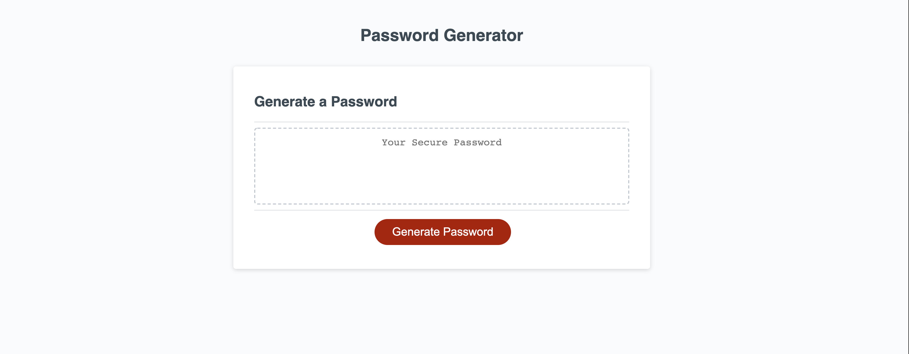
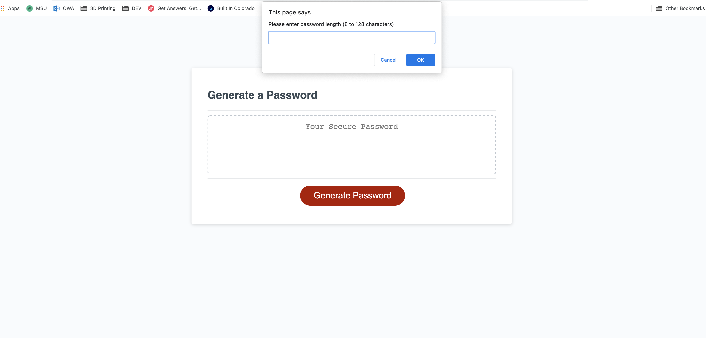
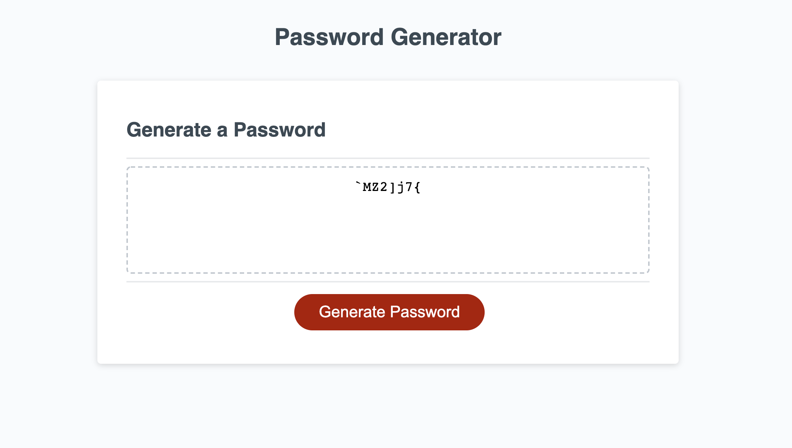

# Password-Generator - JavaScript Application

## This application provides the user with an automatically generated password based on specific types of characters that the user can select from the following list:

<ol>
    <li>"Numbers"
    <li>"Capital Letters"
    <li>"Special Characters"
    <li>"Letters"
</ol>

## When the user runs the application he will be greeted with the following screen where he can press the button "generate password" to begin the process.

## The application will show the user a series of prompts for the selection of the types of characters to include in the password.

## Finally, the application will provide the user with the requested password.

## A link to the application below.

## https://forbegos.github.io/Password-Generator/
